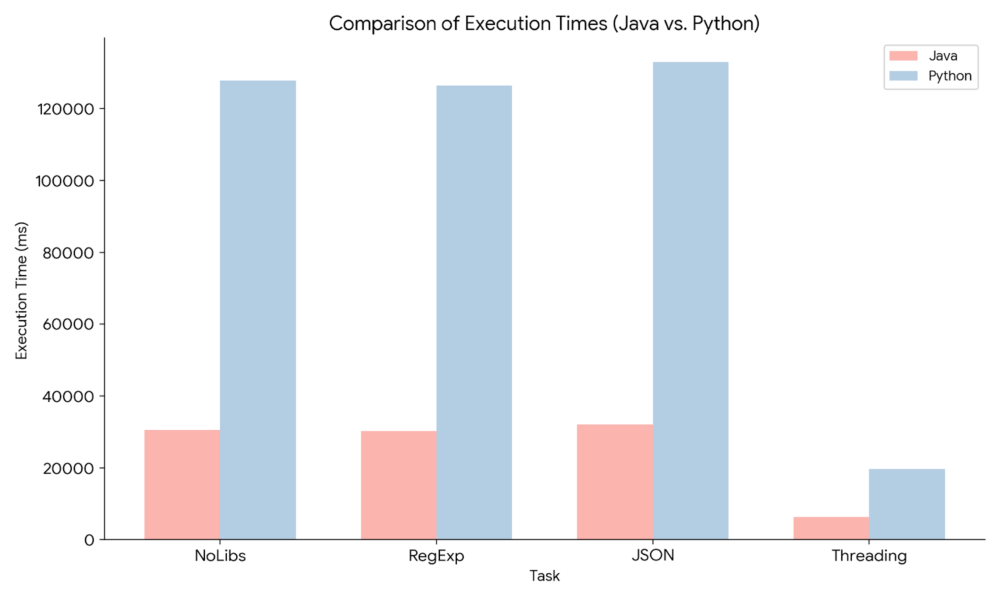

### Performance Comparison Project

This project benchmarks and compares the performance of Java and Python based on time for analyzing data retrieved from the NASA API. It explores various techniques, including:

- **JSON Analysis:** Parsing and processing JSON data from the API.
- **Regex Analysis:** Using regular expressions for data extraction.
- **No Libraries Analysis:** Performing data processing without external libraries.
- **Multithreaded Analysis:** Leveraging multithreading to enhance performance.

The goal is to provide insights into how each language handles these tasks and to identify which performs better under similar conditions based on time measurements.

**Overall Performance**

Java significantly outperformed Python in all tested scenarios, with an average execution time approximately four times faster. While both languages exhibited comparable performance in data processing without libraries (NoLibs), regular expressions (RegExp), and JSON parsing, a substantial performance disparity emerged when employing multithreading. Although Java still outperformed Python in multithreading, the improvement was less pronounced than in other techniques, with a speedup of approximately three times.

**Potential Explanations**

Java's compiler and runtime environment might be better optimized for the tasks at hand.
Python's interpreter might introduce overhead that impacts performance, especially in shorter tasks.

**Conclusion**

Based on the performance metrics, Java exhibited superior performance across all tested scenarios compared to Python. While Java maintained an advantage, particularly in multithreaded operations, the difference was less pronounced compared to other techniques. This indicates that Java's underlying architecture provides notable benefits in execution speed. However, Python shows potential for optimization in multithreaded workloads, suggesting opportunities for further performance improvements.

 

